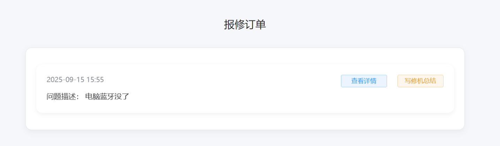
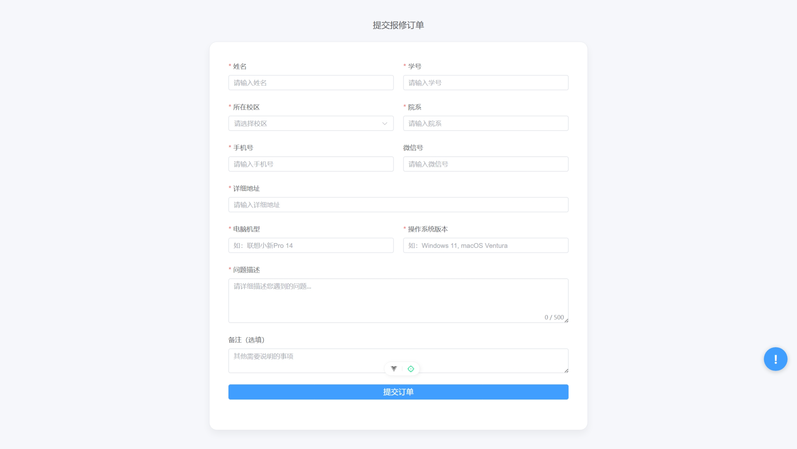

# volunteer-team

前端：vue3，element-plus，pinia
后端：gin，gorm，redis，mysql，rabbitmq

这是一个集成了登录模块，报单模块，撰写总结模块，同时有一定权限认证的web网站

## 登录模块


### 内部人员主页以及功能展示





### 普通用户主页以及功能展示





后端表设计

##### 用户表

```go
type User struct {
    ID       int    `gorm:"primaryKey;column:id;type:int;comment:'主键ID'"`
    UserID   int64  `gorm:"column:user_id;type:bigint;unique,comment:'用户ID'"`
    Ctime    int64  `gorm:"column:ctime;type:bigint;comment:'创建时间'"`
    Utime    int64  `gorm:"column:utime;type:bigint;comment:'更新时间'"`
    Account  string `gorm:"column:account;type:varchar(20);unique;comment:'账号'"`
    Password string `gorm:"column:password;type:varchar(20);not null;comment:'密码'"`
    Email    string `gorm:"column:email;type:varchar(20);unique;comment:'邮箱'"`
    Username string `gorm:"column:username;type:varchar(20);not null;comment:'用户名'"`
    Avatar   string `gorm:"column:avatar;type:varchar(255);not null;comment:'头像'"`
    Role     int8   `gorm:"column:role;type:tinyint;default:2;comment:'角色'"`
}

func (u *User) TableName() string {
    return "user"
}
```

##### 订单表

```go
type Order struct {
    ID                 int    `gorm:"primaryKey;column:id;type:bigint;comment:'主键ID'"`                                                                        // 主键
    UserID             int64  `gorm:"column:user_id;type:bigint;not null;comment:'用户ID';uniqueIndex:idx_user_time,priority:1"`                                // 逻辑外键
    Ctime              int64  `gorm:"column:ctime;type:bigint;not null;comment:'创建时间';uniqueIndex:idx_user_time,priority:2;index:idx_state_time,priority:2;"` // 创建时间
    Utime              int64  `gorm:"column:utime;type:bigint;comment:'更新时间'"`                                                                                // 更新时间
    Username           string `gorm:"column:username;type:varchar(20);not null;comment:'报修人姓名'"`                                                              // 报修人姓名
    StudentID          string `gorm:"column:student_id;type:varchar(20);index;not null;comment:'学号'"`                                                         // 学号
    CampusLocation     string `gorm:"column:campus_location;type:varchar(10);not null;comment:'校区'"`                                                          // 校区
    Department         string `gorm:"column:department;type:varchar(30);not null;comment:'学院'"`                                                               // 学院
    PhoneNumber        string `gorm:"column:phone_number;type:varchar(11);not null;comment:'手机号'"`                                                            // 手机号
    WechatID           string `gorm:"column:wechat_id;type:varchar(30);comment:'微信号'"`                                                                        // 微信号
    Address            string `gorm:"column:address;type:varchar(255);not null;comment:'详细地址'"`                                                               // 详细地址
    DeviceModel        string `gorm:"column:device_model;type:varchar(100);not null;comment:'设备型号'"`                                                          // 设备型号
    OSVersion          string `gorm:"column:os_version;type:varchar(20);not null;comment:'操作系统版本'"`                                                           // 系统版本
    ProblemDescription string `gorm:"column:problem_description;type:text;not null;comment:'问题描述'"`                                                           // 问题描述
    Notes              string `gorm:"column:notes;type:text;comment:'备注'"`
    State              int8   `gorm:"column:state;type:tinyint;default:1;comment:'订单处理状态';index:idx_state_time,priority:1"` // 备注
}

// TableName 设置表名
func (o *Order) TableName() string {
    return "order"
}
```

##### 总结表

```go
type Summary struct {
    ID                 int    `gorm:"primaryKey;column:id;type:bigint;comment:'主键ID'"`                                        // 主键
    OrderID            int    `gorm:"column:order_id;type:bigint;not null;uniqueIndex:idx_order_id;comment:'关联订单ID'"`         // 逻辑外键 → order.id
    UserID             int64  `gorm:"column:user_id;type:bigint;not null;index:idx_user_ctime,priority:1;comment:'用户ID（冗余）'"` // 冗余用户 ID，方便查询
    Ctime              int64  `gorm:"column:ctime;type:bigint;not null;index:idx_user_ctime,priority:2;comment:'创建时间'"`       // 创建时间
    Utime              int64  `gorm:"column:utime;type:bigint;not null;index;comment:'更新时间'"`                                 // 更新时间
    ProblemType        string `gorm:"column:problem_type;type:varchar(50);not null;comment:'问题分类'"`                           // 如：硬件故障 / 软件异常 / 网络问题
    ProblemDescription string `gorm:"column:problem_description;type:text;not null;comment:'问题描述'"`                           // 工程师填写的问题小结
    RepairSummary      string `gorm:"column:repair_summary;type:text;not null;comment:'维修小结'"`                                // 维修过程、解决方案、更换配件等
    ReceiverName       string `gorm:"column:receiver_name;type:varchar(30);not null;comment:'负责人姓名'"`                         // 接待人
}

func (s *Summary) TableName() string {
    return "summary"
}
```